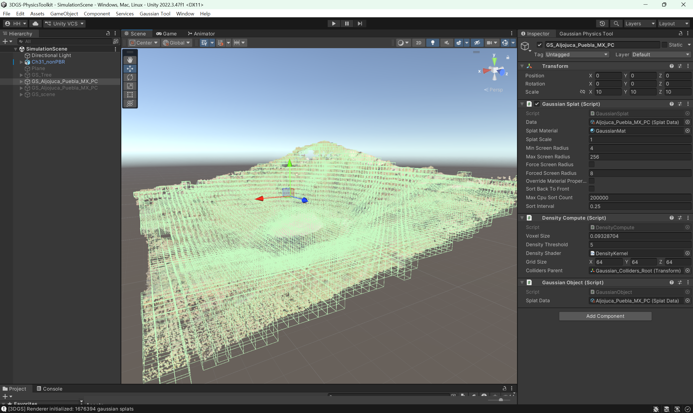
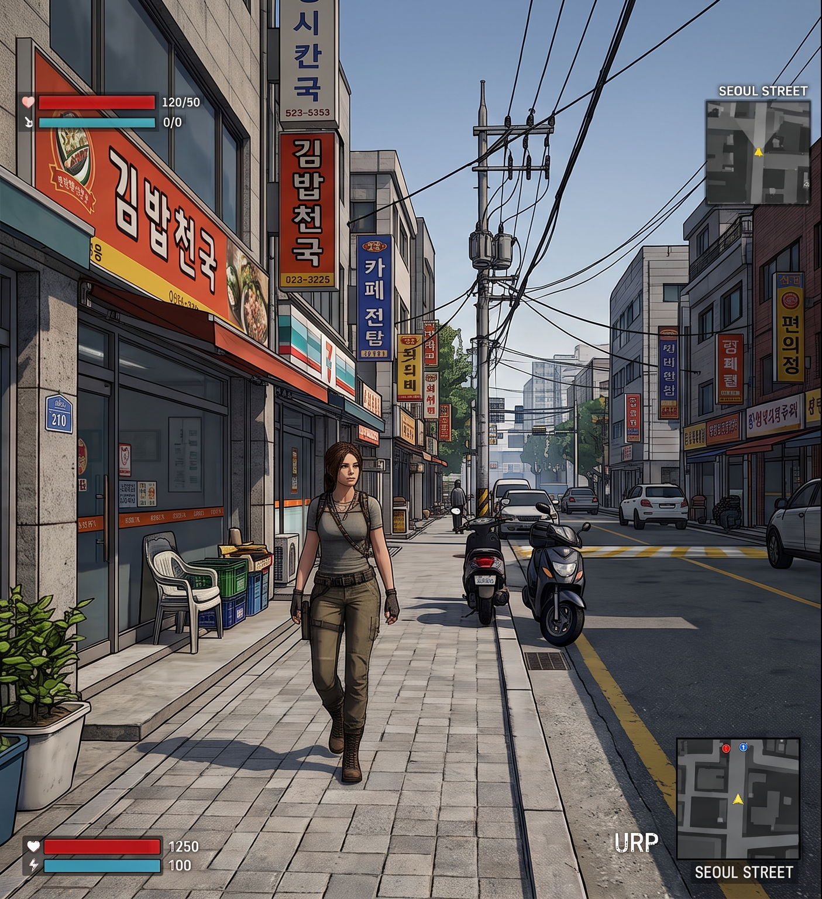
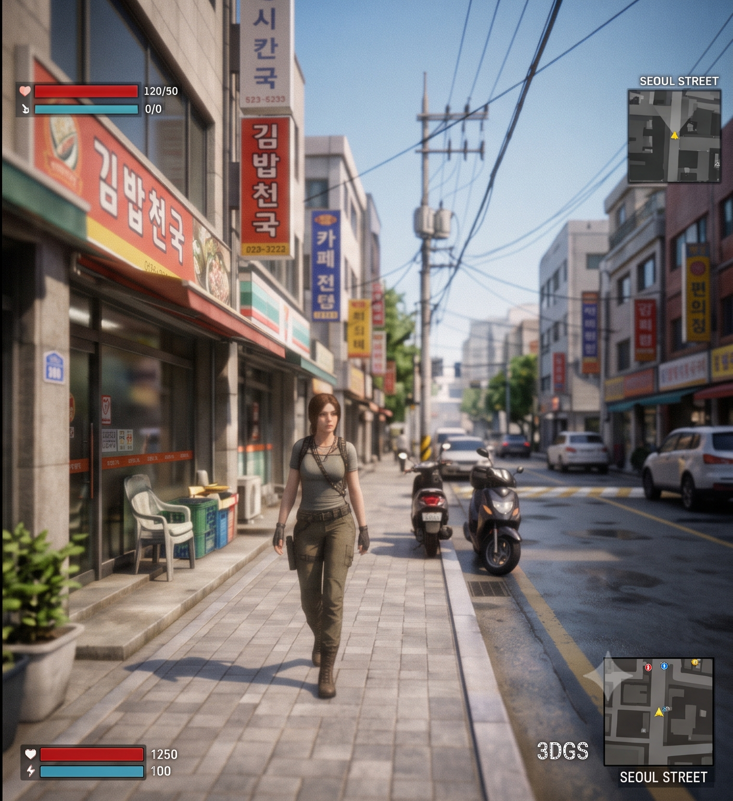

# 3DGS Game Asset Pipeline for Unity URP

[](https://unity.com/)
[](https://unity.com/srp/Universal-Render-Pipeline)
[](LICENSE)




This project provides a comprehensive implementation for importing, optimizing, and rendering **3D Gaussian Splatting (3DGS) assets** within the Unity Universal Render Pipeline (URP), while automatically generating **production-ready physical colliders** for in-game interaction. It is designed to bridge the gap between research-oriented splat generation and production-ready game engine integration, enabling photorealistic radiance fields to act as interactive, collision-enabled game objects.

---
## Contents

1. [Showcase & Preview](#showcase--preview)
2. [Project Overview](#project-overview)
3. [Features](#features)
4. [System Architecture](#system-architecture)
5. [Repository Directory Structure](#Repository Directory Structure)
6. [Getting Started](#getting-started)
7. [Configuration & Usage](#configuration--usage)
8. [Performance & Benchmark](#performance--benchmark)
9. [Roadmap & Future Work](#roadmap--future-work)
10. [License & Contact](#license--contact)

---

## Showcase & Preview

|                   Standard URP Game (Baseline)                   |                        3DGS Pipeline Applied (Ours)                        |
| :--------------------------------------------------------------: | :------------------------------------------------------------------------: |
|               |                         |
| *Original open-source URP game scene with native mesh rendering* | *Photorealistic radiance field integration with real-time depth occlusion* |

> 💡 **Comparison Note**: The left preview shows the baseline open-source URP game scene, while the right demonstrates our custom 3DGS render pass integrated directly into the identical URP gameplay loop.
---

## Project Overview

The **3DGS Game Asset Pipeline** focuses on high-performance rasterization and memory-efficient storage of Gaussian splats. By leveraging GPU compute shaders and custom URP rendering features, this pipeline allows developers to use photorealistic radiance fields as standard game objects.

---

## Features

* **Custom Asset Importer**: Streamlined import pipeline for `.ply` and `.splat` files into Unity sub-assets.
* **URP Integration**: Designed for the Universal Render Pipeline using a dedicated `ScriptableRenderFeature`.
* **Compute-Based Processing**: GPU-accelerated per-frame sorting and culling for real-time performance.
* **Efficient Memory Structure**: Structured to manage spherical harmonics and spatial data for Unity URP.
* **View Culling**: Basic frustum culling support to handle scene visibility.
* **Edit-time Preview**: Real-time visual feedback directly within the Unity Scene View.

---

## System Architecture

The pipeline is divided into three distinct layers to ensure modularity and performance:


```
+-------------------------------------------------------------------+
|                     1. Data Layer (Import)                        |
|   .ply / .splat  -->  Custom ScriptableObject  --> GraphicsBuffer |
+-------------------------------------------------------------------+
                                  |
                                  v
+-------------------------------------------------------------------+ 
|                     2. Processing Layer (Compute)                 |
|   Culling Kernel (Frustum)  -->  Sorting Kernel (GPU Radix Sort)  |
+-------------------------------------------------------------------+
                                  |
                                  v
+-------------------------------------------------------------------+
|                  3. Presentation Layer (Shading)                  |
|   URP Fragment/Vertex Shader  -->  2D Gaussian Alpha Blending     |
+-------------------------------------------------------------------+

```

- **Data Layer (Import & Storage) :** Dource data is processed through a custom ScriptableObject format. During import, the pipeline calculates bounding volumes and performs initial data normalization. Splats are stored in GraphicsBuffer objects at runtime.

* **Processing Layer (Compute) :** The GPU manages the heavy lifting through two primary compute kernels:

* **Sorting Kernel :** Uses a bitonic or radix sort to order splats based on their distance from the camera plane.

* **Culling Kernel :** Filters out splats based on the camera frustum and optional occupancy masks.

* **Presentation Layer (Shading) :** A specialized URP Fragment/Vertex shader performs the final rasterization. It calculates the 2D footprint of each 3D Gaussian and handles alpha-blending logic according to the radiance field mathematical model.


---

## Repository Directory Structure

Our project is structured as an independent UPM (Unity Package Manager) package, completely isolated from standard project assets to ensure seamless portability via Git URL:

```text
Packages/com.team.3dgs-auto-collider-urp/
├── Editor/             # Custom ScriptedImporter & Editor GUI tools
├── Runtime/            # Core runtime logic & memory management
│   ├── Core/           # GaussianSplatAsset & data structures
│   ├── Physics/        # GPU density-field analysis & MeshCollider generation
│   └── Rendering/      # ScriptableRendererFeature & render passes
└── Shaders/            # HLSL compute kernels (Frustum Culling, Radix Sort)

```

---

## Getting Started

### Prerequisites

- **Unity Engine**: `2022.3 LTS` or higher
- **Render Pipeline**: Universal Render Pipeline (URP `14.0+`)
- **Graphics API**: Direct3D 11 / Direct3D 12 / Vulkan (Compute Shader support required)
- **Target Platform**: Windows x64 (Standalone)

## Installation (UPM)

1. Open your Unity Project.
2. Navigate to `Window` -> `Package Manager`.
3. Click the `+` button at the top-left corner and select **Add package from git URL...**.
4. Paste the repository URL:
   ```text
   [https://github.com/HHW9944/3dgs-auto-collider-urp.git]
   ```


---


## Configuration & Usage

### 1. Register URP Render Feature
To inject the 3DGS rendering pass into your active render pipeline:
1. Locate your project's **Universal Renderer Data** asset (e.g., `PC_Renderer`).
2. Click **Add Renderer Feature** at the bottom of the Inspector.
3. Select **`GaussianSplatRenderFeature`**.
4. Ensure the `Event` is set to `AfterRenderingTransparents` (or before Post-Processing).
### 2. Import PLY / SPLAT Dataset
1. Drag and drop your raw `.ply` or `.splat` files into the `Assets` folder.
2. The custom `ScriptedImporter` will automatically build a **`GaussianSplatAsset`** containing compressed VRAM buffers.
3. Select the imported asset to inspect quantization options:
   - **Position Quality**: High (16-bit Float) / Medium (10-bit Vector)
   - **SH Degree**: Max Degree 3 (Full directional color) / Degree 0 (Albedo only)
### 3. Scene Setup & Auto-Collider Generation
1. Create an empty GameObject in your Scene: `GameObject` -> `3DGS` -> `Gaussian Splat Volume`.
2. Assign the imported `GaussianSplatAsset` to the **`GaussianSplatRenderer`** component.
3. Check **`Enable Auto Mesh Collider`** in the Inspector.
   - The GPU compute pass will analyze spatial density and automatically instantiate a low-poly `MeshCollider` child object for physical interaction.

---

## Performance & Benchmark

### Key Metrics for Evaluation

This project is in an active state of development. The following key performance metrics will be measured and presented in the near future:

1. **Rendering Performance (FPS)**
   - Compare framerates (Frames Per Second) between standard URP mesh rendering and our custom 3DGS render pass on identical scenes at 1080p.

2. **Memory Footprint (VRAM)**
   - Measure the VRAM reduction achieved by our custom asset importer, focusing on quantization of positions, spherical harmonics (SH), and covariance matrices.

3. **Asset Compression Ratio**
   - Track the total storage size reduction from raw `.ply`/`.splat` files to our compressed Unity assets.

4. **Collider Generation Time**
   - Measure the latency (milliseconds) between loading a new 3DGS scene and the instantiation of the GPU-generated Mesh Collider.

---

## Roadmap & Future Work

- [ ] **v0.1**: Core URP Render Pass & 3DGS Splat Rendering integration.
- [ ] **v0.2**: GPU Density-Field computation & spatial point analysis pipeline.
- [ ] **v0.3**: Automated low-poly MeshCollider generation & PhysX integration.
- [ ] **v1.0**: To be determined.

---

## 📜 License

Distributed under the MIT License. See [`LICENSE`](LICENSE) for more information.

```text
MIT License

Copyright (c) 2026 Team 3DGS Auto-Collider

Permission is hereby granted, free of charge, to any person obtaining a copy
of this software and associated documentation files (the "Software"), to deal
in the Software without restriction, including without limitation the rights
to use, copy, modify, merge, publish, distribute, sublicense, and/or sell
copies of the Software, and to permit persons to whom the Software is
furnished to do so, subject to the following conditions:

The above copyright notice and this permission notice shall be included in all
copies or substantial portions of the Software.
```

---

## 📬 Contact & Acknowledgments

* **Team**: KU University 2026 Second Graduation Project(3192) Team1
* **Repository**: https://github.com/HHW9944/3dgs-auto-collider-urp.git

### Benchmark Repositories & References

* **Unity URP Architecture & Integration**: 
  * [Unity-Technologies/Graphics](https://github.com/Unity-Technologies/Graphics) — Referenced for Universal Render Pipeline (URP) native render feature architecture and custom render pass injection patterns (`ScriptableRendererFeature`).
* **GPU Compute & Rendering Pipeline**: 
  * [aras-p/UnityGaussianSplatting](https://github.com/aras-p/UnityGaussianSplatting) — Referenced for C#/HLSL compute shader pipeline structure and real-time GPU parallel radix sort implementation for 3D Gaussian Splats.
* **Core Research Foundation**:
  * Kerbl et al., *"3D Gaussian Splatting for Real-Time Radiance Field Rendering"* (SIGGRAPH 2023)